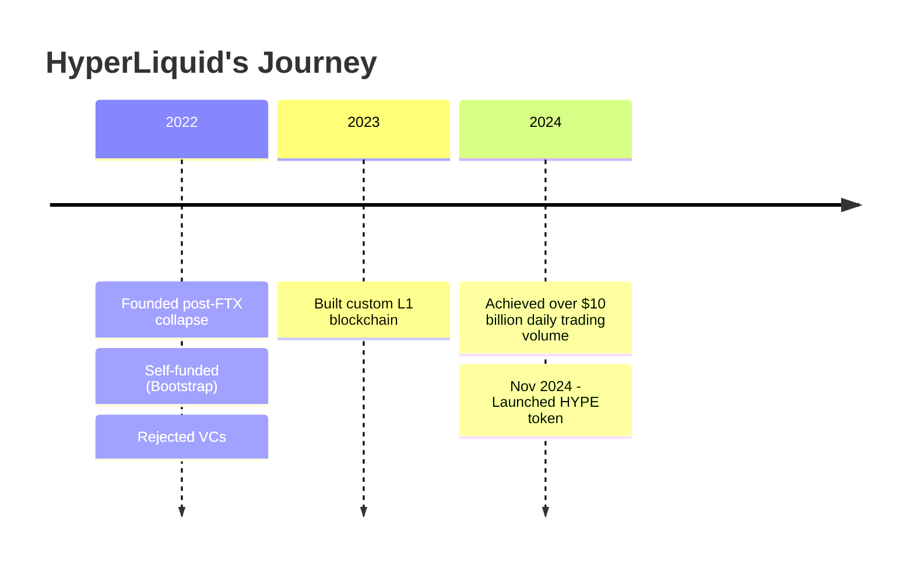
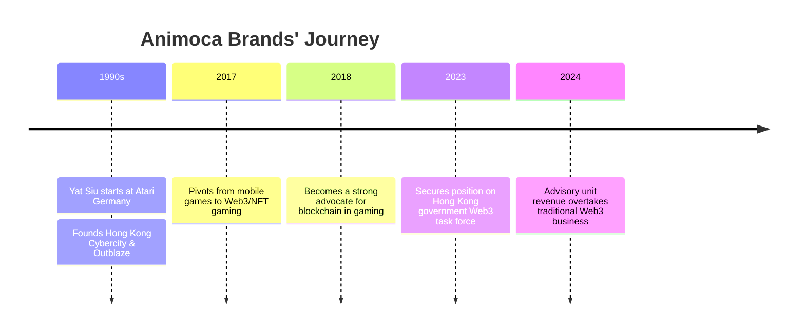
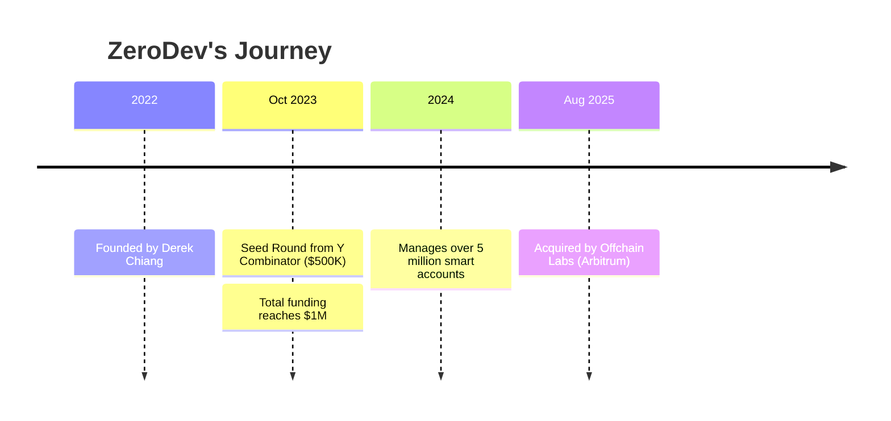
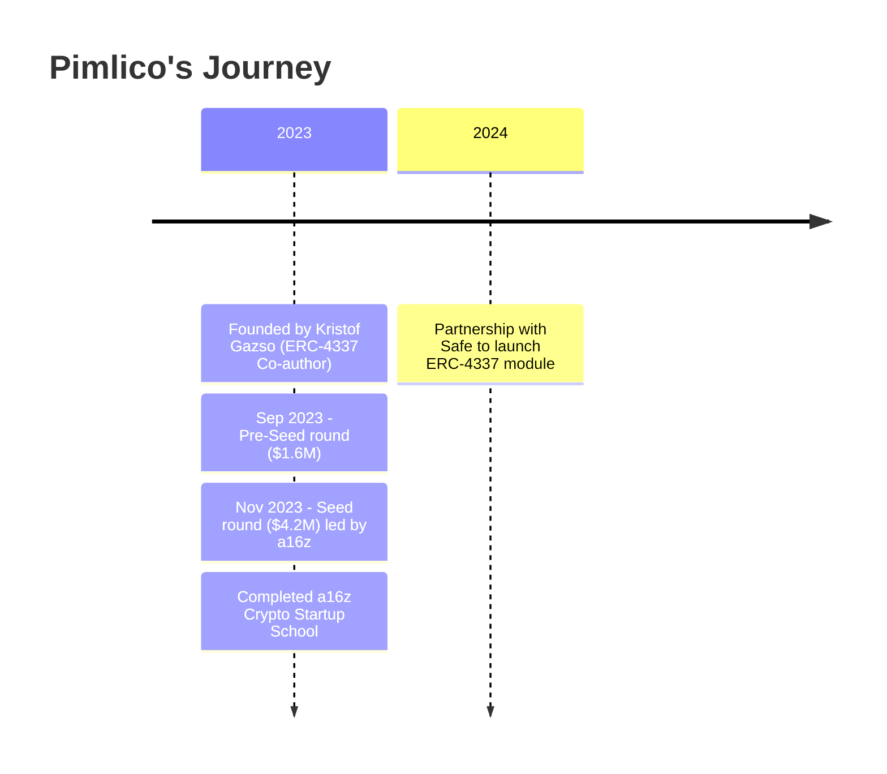
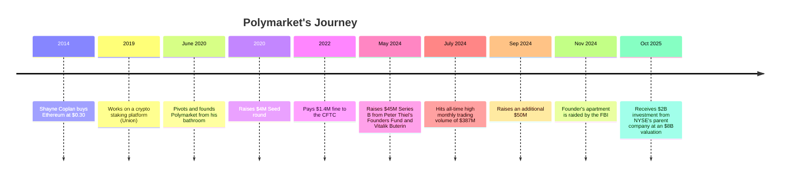
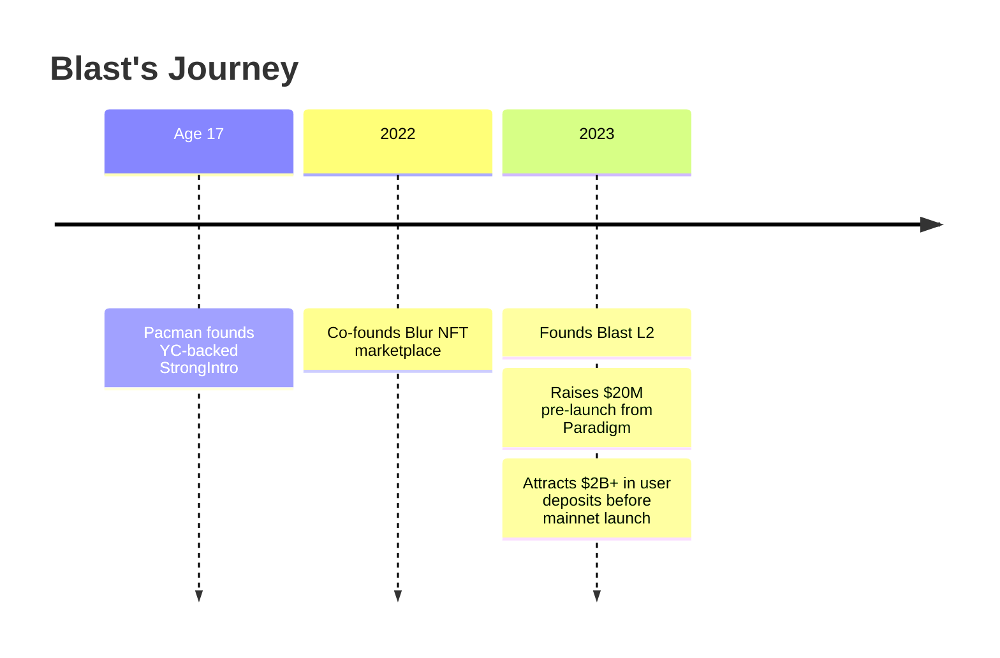
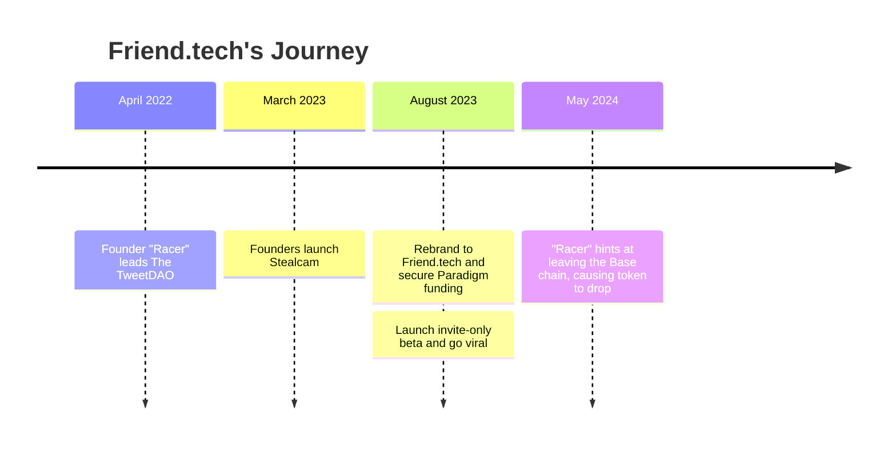

# Web3 Startup Case Studies: Success Stories & Lessons
https://github.com/jhfnetboy/How-to-launch-a-web3-startup/blob/main/README.md

## Case 1: HyperLiquid - The Anti-VC Success Story

**Founder**: Jeff Yan
**Background**: Gold medalist at International **Physics** Olympiad (2013), Harvard graduate, quantitative trader at Hudson River Trading
**Founded**: Post-FTX collapse (2022)

### The Problem They Anchored
After FTX collapsed in November 2022, there was a massive gap in the derivatives exchange market. Users lost trust in centralized platforms but existing decentralized alternatives were slow and expensive.

### The Pivot
Jeff Yan pivoted from a successful quantitative trading career to building HyperLiquid - a fully decentralized perpetuals exchange that could compete with centralized platforms on performance.

### Initial Funding & Unique Path
- **Bootstrap Only**: Self-funded using profits from his trading company
- **Zero VC Money**: Deliberately rejected venture capital to maintain independence
- **Lean Team**: Kept team at just 10 people
- **Philosophy**: "True progress comes from building products people actually use, not from inflated valuations"

### First Success
- Built custom Layer 1 blockchain optimized for trading
- Achieved over $10 billion in daily trading volume
- Launched HYPE token in November 2024 with 31% allocated to users based on trading activity

### Facing Competition
- Competed against Binance, Bybit, and other giants
- Differentiation: 0% fees, full decentralization, superior performance
- **Key Strategy**: Outperformed Binance's 10-year growth in just 2 years

### Team Building
- Started solo with former Harvard classmate Iliensinc as co-founder
- Kept team extremely lean (10 people total)
- Focus on technical excellence over rapid scaling

**Key Characteristics**:
- Anti-VC mindset
- Community-first token distribution
- Technical perfectionism
- Bootstrap sustainability

**Sources**:
- https://www.panewslab.com/en/articles/24vs7xe6
- https://www.blocmates.com/news-posts/founder-jeff-yan-explains-why-hyperliquid-said-no-to-vcs-and-still-won-big
- https://hyperfnd.medium.com/2024-in-review-28c472091320

---

## Case 2: Animoca Brands - The Web3 Berkshire Hathaway

**Founder**: Yat Siu
**Background**: Started at Atari Germany (1990), founded Hong Kong Cybercity (first free web/email provider in Asia), founded Outblaze (sold unit to IBM)
**Founded**: Initially as mobile gaming company, pivoted to Web3 in 2017

### The Problem They Anchored
Traditional gaming companies own all user assets. Players spend money but never truly own anything. Digital property rights don't exist in Web2 gaming.

### The Pivot
**2017**: Pivoted from traditional mobile game developer to blockchain/NFT gaming
- "We saw NFTs and the ability to own digital equity, and it just felt right" - Yat Siu
- **2018**: Became strong advocate for integrating blockchain and NFTs in gaming

**2024 Pivot**: Advisory overtook traditional Web3 business
- Advisory unit: $165M (116% YoY increase)
- Traditional Web3 business: ~40% YoY drop from $182M

### Initial Funding
- Started as Outblaze incubation project
- Pivoted existing company rather than raising fresh capital
- Later became one of largest Web3 investors (540+ portfolio companies)

### First Success
- Became "Berkshire of Web3" through aggressive investment strategy
- Built portfolio of major Web3 gaming companies
- Secured position on Hong Kong government Web3 task force (2023)

### Facing Competition
- Competed in crowded gaming space by focusing on digital property rights thesis
- Differentiation: Investment platform model rather than single product
- Built ecosystem of portfolio companies supporting each other

### Team Building
- Evolved existing Outblaze team into Animoca
- Hired Art Malkov as CMO
- Focus on investment team rather than product development team

**Key Characteristics**:
- Vision-driven pivot
- Portfolio/investment approach
- Government partnerships
- Long-term digital property rights thesis

**Sources**:
- https://www.coindesk.com/web3/2025/03/05/animoca-brands-advisory-overtook-web3-businesses-in-2024-as-the-yat-siu-led-firm-pivots
- https://www.thestreet.com/crypto/markets/berkshire-of-web3-animoca-brands-founder-on-the-future-of-crypto-and-ipo-plans
- https://coingape.com/animoca-brands-yat-siu-on-web3-gaming-nfts-mocaverse/

---

## Case 3: ZeroDev - The Account Abstraction Pioneer

**Founder**: Derek Chiang
**Background**: Started in Nethermind Internship Program learning EIP-4337
**Founded**: 2022, based in New York

### The Problem They Anchored
Web3 user experience is terrible: users need to manage seed phrases, pay gas fees, approve transactions, and understand multiple chains. Mass adoption impossible with current UX.

### The Pivot
Focused exclusively on ERC-4337 account abstraction after Vitalik promoted it in 2022. Built "wallets as a service" infrastructure.

### Initial Funding
- **Seed Round (Oct 2023)**: $500K from Y Combinator
- **Total Raised**: $1M from a16z, YC, 6th Man Ventures, Orange DAO, Press Start Capital
- Joined Y Combinator batch

### First Success
- Managed over 5 million smart accounts across EVM chains
- Secured major clients: Infinex, DeFi.app, DIMO, Crossmint, Yellow, Rodeo
- Built reputation as leading AA infrastructure provider

### Facing Competition
- Competed against Pimlico, Biconomy, Alchemy
- Differentiation: Developer-first SDK, comprehensive documentation, modular approach

### Major Exit
**August 2025**: Acquired by Offchain Labs (Arbitrum)
- Financial terms undisclosed
- "Our goal has always been to bring more people on-chain... Now we can tackle UX at all layers" - Derek Chiang

### Team Building
- Started through Nethermind internship with Lukasz Rozmej
- Built lean developer-focused team
- Integrated into Arbitrum ecosystem post-acquisition

**Key Characteristics**:
- Early mover on ERC-4337
- Developer-first approach
- YC validation
- Strategic acquisition exit

**Sources**:
- https://www.ycombinator.com/companies/zerodev
- https://www.prnewswire.com/news-releases/offchain-labs-makes-strategic-acquisition-of-zerodev-to-advance-efficient-development-and-use-of-onchain-consumer-applications-302528571.html
- https://blockworks.co/news/arbitrums-zerodev-bet

---

## Case 4: Pimlico - ERC-4337 Co-Author's Journey

**Founder**: Kristof Gazso (Co-author of ERC-4337 with Vitalik Buterin)
**Background**: Nethermind Internship Program, worked with Lukasz Rozmej on EIP-4337
**Founded**: 2023

### The Problem They Anchored
ERC-4337 existed as a standard but needed robust infrastructure for developers to actually implement account abstraction at scale.

### The Pivot
From being ERC-4337 co-author to building the infrastructure company that powers it. Transitioned from research to product.

### Initial Funding
- **Pre-Seed (Sep 2023)**: $1.6M led by 1confirmation
  - Backers: Safe, Consensys, 10+ angel investors
- **Seed (Nov 2023)**: $4.2M led by a16z crypto
  - Completed a16z Crypto Startup School 2023 accelerator first
- **Total**: $5.8M across 2 rounds

### First Success
- Launched advanced infrastructure for ERC-4337
- Partnership with Safe to launch ERC-4337 module
- Became go-to infrastructure for smart contract wallets
- Enabled gasless transactions, multi-chain compatibility, modular features

### Facing Competition
- Direct competitor with ZeroDev, Biconomy, Stackup
- Differentiation: Co-author credibility, a16z backing, Safe partnership
- Focus on infrastructure robustness over SDK simplicity

### Team Building
- Started from Nethermind ecosystem
- Leveraged ERC-4337 co-author status for hiring
- Built relationships through a16z accelerator

**Key Characteristics**:
- Technical authority (ERC-4337 co-author)
- Research-to-product journey
- Strategic accelerator participation
- Partnership-first GTM strategy

**Sources**:
- https://blog.pimlico.io/posts/seed
- https://blog.pimlico.io/posts/pre-seed
- https://safe.global/blog/pimlico-and-safe-launch-erc-4337-module
- https://web3galaxybrain.com/episode/Kristof-Gazso-Founder-of-Pimlico

---

## Case 5: Polymarket - Bathroom to Billionaire

**Founder**: Shayne Coplan (born 1998)
**Background**: NYU dropout, bought Ethereum at $0.30 in 2014 ICO, built crypto staking platform (Union)
**Founded**: June 2020 during COVID

### The Problem They Anchored
Information discovery is broken. People need better ways to understand what will actually happen in the world. Traditional polling and media are biased.

### The Pivot
**2019**: Working on crypto staking platform Union (had VC funding)
- "Fed up with crypto grifts" - explored economist Robin Hanson's prediction market ideas
- Thought: "This is too good to just exist in whitepapers"

**2020**: COVID hit - perfect timing
- Pivoted to prediction markets for "stuck-at-home folks to bet on real-world outcomes"
- Built from bathroom as solo founder, age 21, running out of money

### Initial Funding
- **Seed (2020)**: $4M soon after launch
- **Series A (undisclosed)**: $25M led by General Catalyst
  - Investors: Joe Gebbia (Airbnb), Polychain
- **Series B (May 2024)**: $45M led by Peter Thiel's Founders Fund
  - Investors: Vitalik Buterin, 1confirmation, ParaFi, Dragonfly
- **Additional (Sep 2024)**: Raised $50M more
- **Total**: $70M+ before major exit
- **October 2025**: $2B investment from Intercontinental Exchange (NYSE parent) at $8B valuation

### First Success
- Launched June 2020 on Polygon (lower fees than competitors)
- 0% platform fees
- July 2024: $387M monthly trading volume (all-time high)
- Became world's largest prediction market

### Facing Competition
**Competitors**: Augur, Gnosis, Omen, DuelNow, Vega

**Why Polymarket Won**:
1. **Better UX**: Simple, user-friendly vs complex competitors
2. **More markets**: Far more categories than any competitor
3. **Lower costs**: 0% fees on Polygon vs high Ethereum gas on Augur
4. **Better liquidity**: Easier onboarding = more users = better markets
5. **Timing**: Augur launched too early (high gas), Polymarket launched when Layer 2s were ready

### Team Building
- Started as solo founder in bathroom
- Hired Nate Silver (polling superstar)
- Art Malkov as CMO
- Kept details of early team private

### Facing Regulatory Challenges
- 2022: Paid $1.4M to CFTC, agreed to wind down unregistered markets
- Continued operating with restrictions
- November 2024: FBI raid on Coplan's apartment (politically motivated per supporters)
- Persisted through regulatory pressure

**Key Characteristics**:
- Solo founder grit
- Perfect timing (COVID + Layer 2 maturity)
- 0% fees business model
- High-profile investor validation (Thiel, Vitalik)
- Regulatory risk tolerance
- Network effects/liquidity focus

**Age milestones**:
- Age 21: Solo founder, broke, bathroom office
- Age 26: Youngest self-made billionaire

**Sources**:
- https://fortune.com/2024/11/08/polymarket-ceo-shayne-coplan-founded-company-from-bathroom/
- https://www.coindesk.com/business/2024/05/14/peter-thiels-founders-fund-vitalik-buterin-back-45m-investment-in-polymarket
- https://medium.com/@griffycommunity/from-augur-to-polymarket-a-comparative-analysis-of-leading-prediction-market-platforms-48c2f75bab91
- https://cointelegraph.com/news/polymarket-founder-coplan-billionaires-nyse-investment

---

## Case 6: Blast - The Controversial Speedrun

**Founder**: Pacman (Tieshun Roquerre)
**Background**: Dropped out at age 16, founded StrongIntro at 17 (YC-backed, raised $120K), MIT dropout, co-founded Blur (2022)
**Founded**: 2023

### The Problem They Anchored
Layer 2s offer scalability but users' deposited assets sit idle earning nothing. DApps can't monetize without extracting value from users.

### The Pivot
After Blur (NFT marketplace) unseated OpenSea as #1 by volume, Pacman pivoted to building Layer 2 infrastructure with native yield.

### Initial Funding
- **Pre-launch**: Raised $20M led by Standard Crypto and Paradigm
- **Total raised**: $25M+ from Paradigm, eGirl Capital, Standard Crypto, and others
- **Unique approach**: Solicited $2B+ in deposits to multisig BEFORE L2 was built (highly controversial)

### First Success
- Drew $2B+ in Total Value Locked before mainnet launch
- "Airdrop farming" narrative drove massive early adoption
- Built on success of Blur's token distribution model

### Facing Competition
- Competed against Arbitrum, Optimism, Base, zkSync
- Differentiation: Native yield on ETH/stablecoins, aggressive airdrop marketing

### Facing Criticism
- Accused of Ponzi scheme mechanics
- Pacman rejected criticism: "Paradigm suggested strategy change"
- Community split on whether it's innovative or exploitative
- High-risk, high-reward reputation

### Team Building
- Co-founder Anthony Liu (found at MIT)
- Extended team from Blur success
- Young, aggressive team culture

**Key Characteristics**:
- Serial entrepreneur (3rd startup by mid-20s)
- YC pedigree
- Controversial growth tactics
- Airdrop-driven user acquisition
- Strong backing despite controversy (Paradigm)
- Blur's success as launchpad

**Sources**:
- https://www.binance.com/en/square/post/10060587946562
- https://www.theblock.co/post/264668/pacman-chews-over-blast-ponzi-scheme-criticisms-humorous-memes
- https://blockworks.co/news/blast-developers-layer-2-liquidity

---

## Case 7: Friend.tech - The Viral SocialFi Experiment

**Founders**: Racer (@0xRacerAlt) and Shrimp (@shrimppepe) - pseudonymous
**Background**: Racer led The TweetDAO (viral April 2022), both created Stealcam (March 2023)
**Founded**: August 2023 (rebranded from Stealcam)

### The Problem They Anchored
Social media platforms extract all value from creators and their relationships. Creators can't monetize their social capital directly. Fans can't invest in creators early.

### The Pivot
**TweetDAO → Stealcam → Friend.tech**
- **TweetDAO**: Experimented with algorithmically increasing NFT prices
- **Stealcam (March 2023)**: On Arbitrum, 313 ETH volume ($500K) in 2 weeks, $100K protocol revenue
- **Friend.tech (August 2023)**: Upgraded product, rebranded, secured Paradigm funding

### Initial Funding
- **Seed Round**: Paradigm (undisclosed amount)
- Raised BEFORE public launch based on Stealcam traction

### First Success
- **August 10, 2023**: Launched invite-only beta
- **Day 1**: Went viral immediately, hit server capacity
- **August 11-28**: Reached $6.4M TVL, $1.5M+ daily fees
- **Peak**: 115,000+ unique users from 10,000 initial

**Racer's reaction**: "We initially shared the app to start load testing and didn't expect it to go viral"

### Facing Competition
- Part of broader SocialFi wave
- Differentiation: Bonding curve mechanics, invite system, mobile-first
- Base chain selection (Coinbase L2) for credibility

### The Challenges
- Revenue dropped ~90% from peak (DL News)
- Model criticized as unsustainable
- **May 2024**: Racer hinted at leaving Base, FRIEND token fell 30%
- SocialFi narrative faded

### Team Building
- Small pseudonymous team
- "Spending days preoccupied with scaling infrastructure, fixing bugs, setting up guardrails" - Racer
- Kept team lean during viral growth

**Key Characteristics**:
- Pseudonymous founders
- Rapid iteration (3 products in 18 months)
- Paradigm validation despite anonymity
- Viral mechanics design expertise
- MVP → Funding → Scale model
- Mobile-first approach
- High-risk social experimentation

**Lessons**:
- Viral launch ≠ sustainable business
- SocialFi mechanics are hard to sustain
- Paradigm backing doesn't guarantee success
- Fast rise can mean fast fall

**Sources**:
- https://decrypt.co/153270/friend-tech-founders-say-viral-crypto-app-is-surprising-them-too-we-want-to-catch-our-breath
- https://www.dlnews.com/articles/defi/socialfi-rose-in-popularity-last-year-before-falling/
- https://www.theblock.co/post/296790/friend-tech-price-drops-over-20-after-co-founder-racer-hints-at-leaving-base

---

## Common Patterns Across Successful Web3 Startups

### 1. **Timing is Everything**
- HyperLiquid: Post-FTX gap
- Polymarket: COVID lockdowns
- ZeroDev/Pimlico: ERC-4337 standardization
- Blast: L2 summer + airdrop meta

### 2. **Pivot from Previous Success**
- Animoca: Mobile games → Web3 gaming
- Blast: Blur → L2
- Friend.tech: TweetDAO → Stealcam → Friend.tech
- Polymarket: Crypto staking → Prediction markets

### 3. **Founder Credibility Matters**
- Technical: Jeff Yan (trading), Kristof Gazso (ERC-4337 co-author)
- Serial: Pacman (3 startups by mid-20s), Yat Siu (multiple exits)
- Network: Paradigm, a16z, Vitalik backing signals quality

### 4. **Bootstrap vs VC: Both Work**
- Bootstrap: HyperLiquid (zero VC)
- VC-heavy: Polymarket ($70M+), Blast ($25M), Pimlico ($5.8M)
- Hybrid: ZeroDev (small seed → acquisition)

### 5. **Community Token Distribution Wins**
- HyperLiquid: 31% to users
- Polymarket: No token yet, but community-first
- Friend.tech: Points system
- Blast: Airdrop expectation drove $2B deposits

### 6. **Team Size: Stay Lean**
- HyperLiquid: 10 people
- Polymarket: Solo founder start
- Friend.tech: Small pseudonymous team
- ZeroDev/Pimlico: Developer-focused, minimal headcount

### 7. **Regulatory Risk Tolerance**
- Polymarket: $1.4M CFTC fine, FBI raid, kept building
- Blast: Ponzi accusations, kept building
- HyperLiquid: Decentralized to avoid regulatory capture

### 8. **The Power of "No"**
- HyperLiquid: Said no to VCs
- Polymarket: Said no to traditional finance route
- ZeroDev: Focused AA, said no to expanding too fast

### 9. **Accelerators as Validation**
- YC: ZeroDev, Pacman (StrongIntro)
- a16z CSX: Pimlico
- None: HyperLiquid, Polymarket (direct VC)

### 10. **Exit Strategies Vary**
- IPO path: Animoca Brands
- Strategic acquisition: ZeroDev → Offchain Labs
- Stay independent: HyperLiquid, Polymarket
- Token launch: Blast, Friend.tech

---

## Key Takeaways for Aspiring Web3 Founders

1. **Start building during downturns** - Best projects launch in bear markets
2. **Solve real problems, not hype trends** - HyperLiquid (FTX gap), Polymarket (information discovery)
3. **Choose your funding strategy deliberately** - VC vs Bootstrap both viable
4. **Be willing to pivot quickly** - Most founders had 2-3 projects before success
5. **Time the market** - Technical readiness + market need + user psychology
6. **Distribution > Product** - Friend.tech had worse tech than competitors but better virality
7. **Regulation is a feature, not a bug** - Willing to operate in gray areas
8. **Community ownership** - Token distribution to users creates network effects
9. **Stay lean** - Small teams ship faster
10. **Credibility compounds** - Technical expertise, previous exits, or high-profile backers open doors
